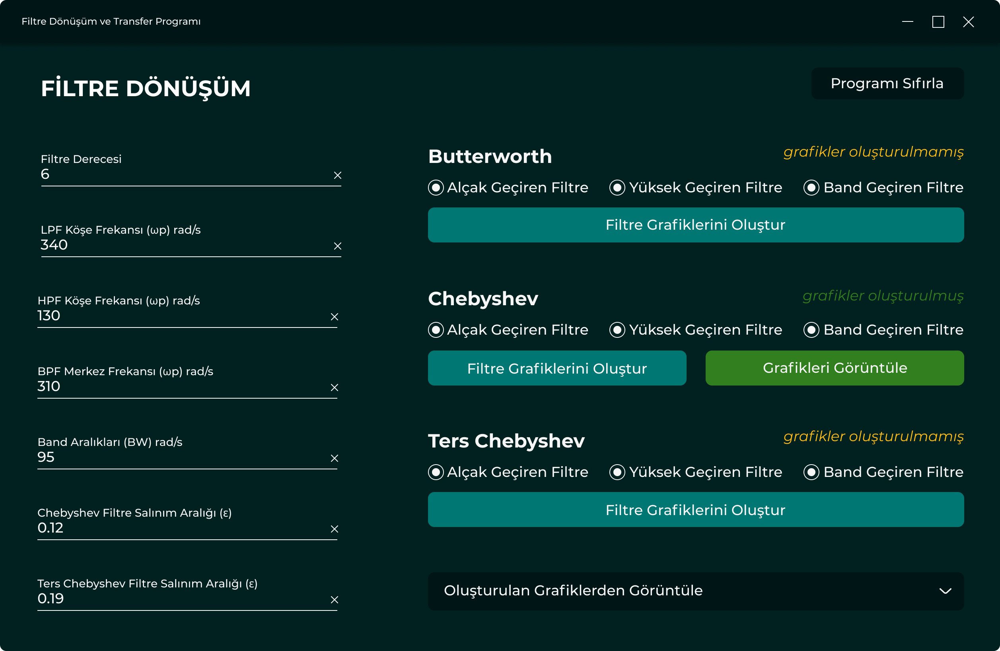

# Filter Design and Transformation

## Filter Design Tool (Butterworth, Chebyshev, Inverse Chebyshev)

This program allows users to design various types of filters (_Low Pass, High Pass, and Band Pass_) based on the Butterworth, Chebyshev, and Inverse Chebyshev filter design methods. Built using **C++ and Python with a Qt6 GUI**, the tool provides an intuitive interface for inputting filter parameters and visualizing results.

The program supports three well-known filter design methods:

- *Butterworth Filter:* Known for its maximally flat frequency response in the passband.
- *Chebyshev Filter:* Provides a steeper roll-off compared to Butterworth but introduces ripple in the passband.
- *Inverse Chebyshev Filter:* Similar to Chebyshev but with ripple in the stopband rather than the passband.




### Features:
- Filter Types: Design Low Pass, High Pass, and Band Pass filters.
- Design Methods: Choose from Butterworth, Chebyshev, or Inverse Chebyshev filters.
- Interactive Interface: Input filter parameters (cutoff frequency, order, etc.) via an easy-to-use GUI.
- Graphical Output: View frequency response graphs directly within the application.
- CSV Export: Export filter design data and results to CSV format for further analysis or documentation.


### Requirements:
- Qt6 for the graphical user interface.
- C++ and Python for the backend computation.

### Step-by-Step Installation:

Clone this repository to your local machine using Git

```sh
git clone https://github.com/zahidayturan/filter-design-and-transformation.git
```
Install Qt6 by following the instructions on the official Qt website: [Qt6 Installation Guide](https://doc.qt.io/qt-6/get-and-install-qt.html)

Build the C++ Code. Open a terminal/command prompt and navigate to the project directory. Use CMake to configure and build the project

```sh
mkdir build
cd build
cmake ..
make
```

Install the required Python libraries using pip. Create a virtual environment (optional but recommended) and install the dependencies

Run the Application: Once the application is built, you can run it directly

After the application starts, you can begin designing filters by selecting the filter type, design method, and input parameters.

## How can I support developers?
- Star this GitHub repo
- Create pull requests, submit bugs, suggest new features or documentation updates
- Follow my work